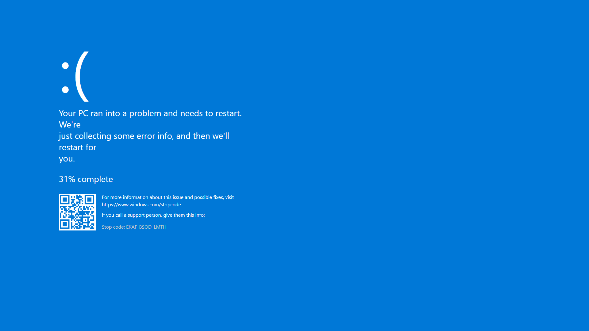

# 💻 Fake BSOD Windows 10

🔵 **Fake BSOD (Blue Screen of Death)** is a simulation of the classic Windows 10 blue screen interface – created for fun, entertainment, demos, or as a light-hearted prank for friends.

> ❗ **Completely harmless** to your system. It does not interfere with software or the operating system – it's just a visual simulation.

---

## 🚀 Purpose

- Simulates the Windows 10 BSOD screen using HTML, CSS, and JavaScript.

---

## 🧪 Demo

Try the live demo at:  
📎 [https://bsod-windows.vercel.app/](https://bsod-windows.vercel.app/)

---
